<p align="center">
  
</p>

Сервер учета и разрешения IP-адресов контроллеров Wiren Board по их MAC-адресам. Построен на FastAPI и SQLite.

---

## Быстрый запуск

### Без клонирования репозитория (через uvx)

Если установлен [uv](https://docs.astral.sh/uv/), сервер можно поднять одной командой напрямую из GitHub:

```bash
uvx --from git+https://github.com/Kazinagg/mactoip.git mactoip
```

Сервер сразу доступен:
- Веб-интерфейс: [http://localhost:8000/](http://localhost:8000/)
- Документация OpenAPI: [http://localhost:8000/docs](http://localhost:8000/docs)
- База данных SQLite сохраняется в `data/devices.db`.

Смена порта или хоста при необходимости:
```bash
# Linux / macOS
PORT=8080 HOST=0.0.0.0 uvx --from git+https://github.com/Kazinagg/mactoip.git mactoip

# Windows PowerShell
$env:PORT=8080; uvx --from git+https://github.com/Kazinagg/mactoip.git mactoip
```

### Через Docker Compose

```bash
git clone https://github.com/Kazinagg/mactoip.git
cd mactoip
docker compose up -d
```

База данных автоматически монтируется в локальную папку `./data` на хосте. Остановка сервиса: `docker compose down`.

### Локальный запуск из исходников

```bash
git clone https://github.com/Kazinagg/mactoip.git
cd mactoip

# Через uv
uv run uvicorn mactoip.main:app --host 0.0.0.0 --port 8000 --reload

# Или стандартный pip
python -m venv .venv
source .venv/bin/activate  # На Windows: .venv\Scripts\activate
pip install -e .
uvicorn mactoip.main:app --host 0.0.0.0 --port 8000
```

<p align="center">
  
</p>

## Как это устроено

1. Контроллер Wiren Board при старте или периодически по cron отправляет запрос на сервер со своим MAC и текущим IP.
2. Сервер приводит MAC к стандарту `AA:BB:CC:DD:EE:FF` и обновляет запись в SQLite:
   - если устройство новое — регистрирует в базе;
   - если IP изменился — сохраняет новый адрес;
   - если адрес прежний — обновляет метку времени последнего обращения (`last_seen`) и счетчик запросов.
3. Любой внешний сервис или администратор может получить актуальный IP контроллера по его MAC в формате JSON или чистым текстом для bash-скриптов.

---

## REST API

| Метод | Путь | Описание |
| :--- | :--- | :--- |
| `POST` | `/api/devices/heartbeat` | Регистрация устройства или обновление IP и времени активности |
| `GET` | `/api/devices` | Список всех устройств (`?search=...`) |
| `GET` | `/api/devices/{mac}` | Данные конкретного устройства |
| `GET` | `/api/devices/{mac}/ip` | Получение IP по MAC (`?format=text` или `?format=json`) |
| `PATCH`| `/api/devices/{mac}` | Обновление имени (hostname) или комментария (локации) |
| `DELETE`| `/api/devices/{mac}` | Удаление устройства из реестра |
| `GET` | `/api/health` | Проверка статуса сервера |

### Примеры запросов

**Отправка данных от контроллера:**
```bash
curl -X POST "http://localhost:8000/api/devices/heartbeat" \
  -H "Content-Type: application/json" \
  -d '{
    "mac": "AC:83:F3:12:34:56",
    "ip": "192.168.1.150",
    "hostname": "wb-kitchen"
  }'
```

**Получение IP по MAC для bash-скриптов:**
```bash
# Возвращает чистую строку с адресом (например, "192.168.1.150")
IP=$(curl -s "http://localhost:8000/api/devices/AC:83:F3:12:34:56/ip?format=text")

# Подключение к контроллеру по SSH в одну команду:
ssh root@$(curl -s "http://localhost:8000/api/devices/AC:83:F3:12:34:56/ip?format=text")
```

---

## Настройка контроллеров Wiren Board

В каталоге [examples/wirenboard_client/](examples/wirenboard_client/) собраны примеры скриптов для специалистов, настраивающих сами контроллеры:

- `wirenboard_agent.sh` — bash-скрипт с автоопределением сетевого интерфейса (`eth0`/`wlan0`) для запуска через `cron`.
- `wirenboard_agent.py` — python-скрипт на стандартной библиотеке без сторонних зависимостей. Поддерживает работу в режиме службы systemd (`--daemon`).
- [Инструкция по настройке cron и systemd](examples/wirenboard_client/README.md).

---

## Тестирование

```bash
uv run pytest -v
```

---

## Разработка

Структура базы данных, архитектура и инструкция по добавлению новых полей описаны в [DEVELOPING.md](DEVELOPING.md).

<p align="center">
  
</p>
